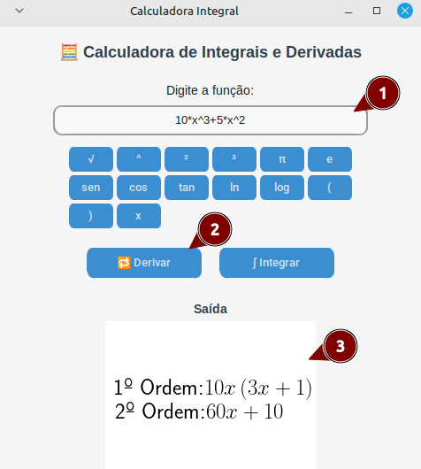
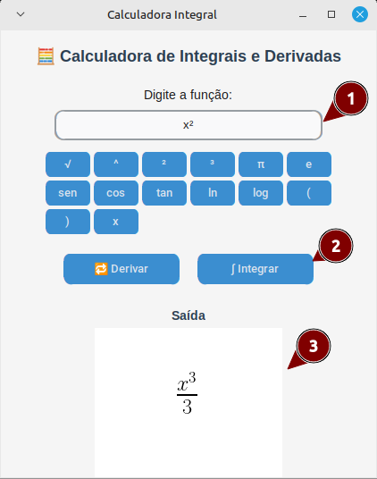

# 🧮 Calculadora Integral com Interface Gráfica

Uma aplicação simples feita com `tkinter` e `sympy` que permite calcular derivadas e integrais indefinidas com uma interface amigável. Inclui um mini teclado de símbolos para facilitar a entrada de funções matemáticas.

## 📦 Requisitos

- Python 3.7 ou superior
- [LaTex](https://www.latex-project.org/)
  - Ubuntu:
```bash
sudo apt-get install dvipng texlive-latex-extra texlive-fonts-recommended cm-super
```

- Bibliotecas:
  - sympy
  - tkinter (já incluída com Python na maioria dos sistemas)
  - customtkinter
  - matplotlib

Instale as dependências com:
```bash
pip install -r requirements.txt
```

## 📍 Exemplo de Uso

# Derivar


# Integrar


# Legenda:
 - 1: Caixa de entrada de expressão matemática
 - 2: Botão para utilizar tal funcionalidade
 - 3: Resultado